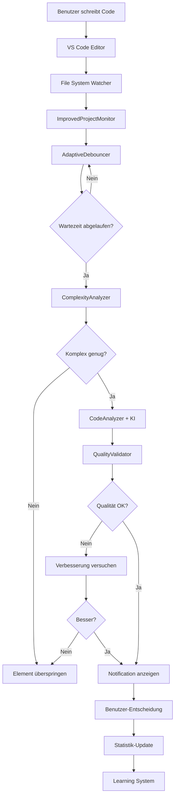
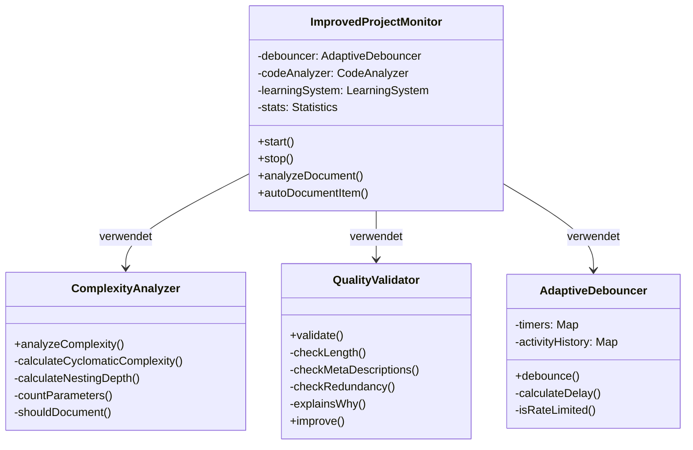
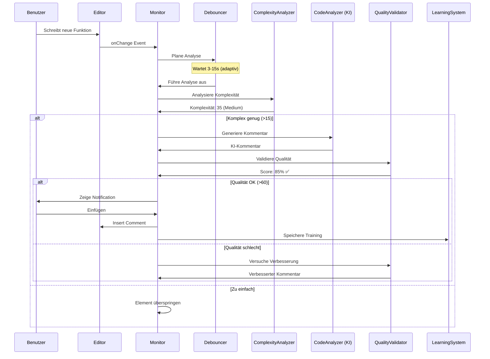
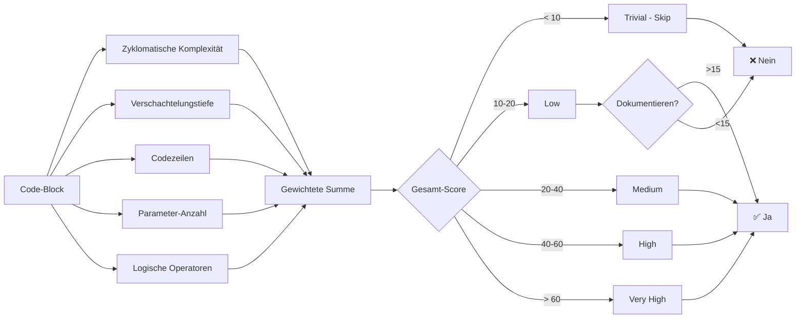
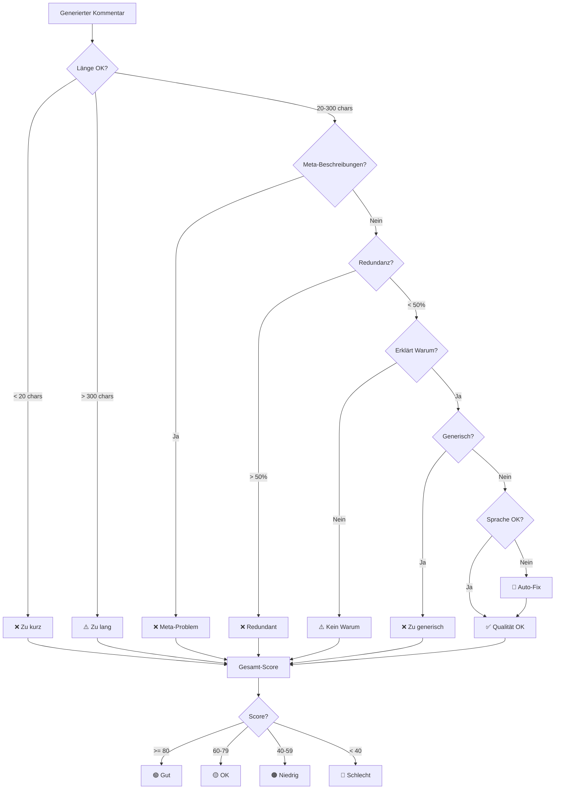
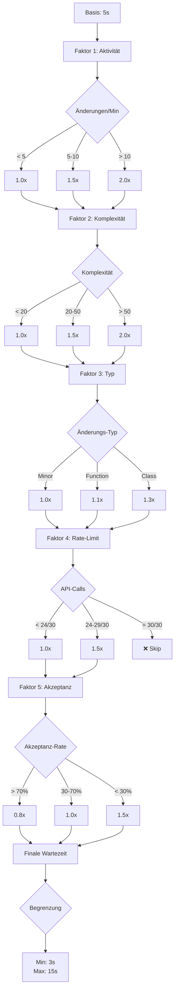
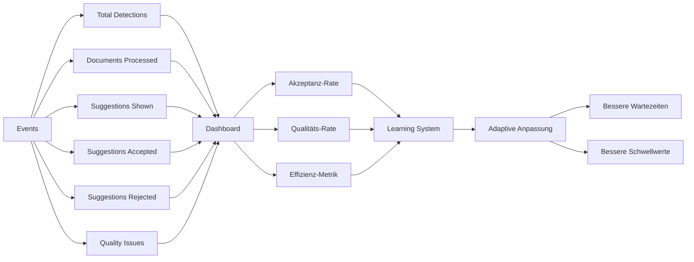
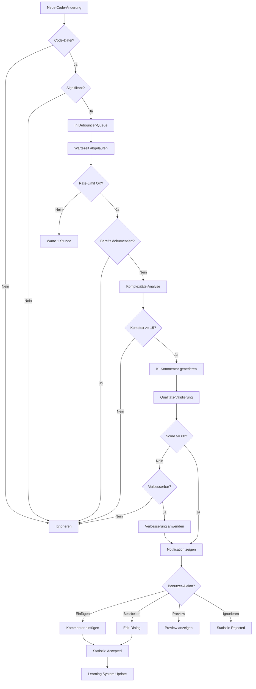

# 📊 Architektur-Diagramme für Diplomarbeit

## 1. System-Übersicht

## 2. Komponenten-Architektur

## 3. Datenfluss

## 4. Komplexitäts-Berechnung

## 5. Qualitäts-Validierung

## 6. Adaptive Wartezeit

## 7. Statistik-Tracking

## 8. Entscheidungsbaum

## Verwendung in Diplomarbeit

### Für Architektur-Kapitel:
- Diagramm 1: System-Übersicht
- Diagramm 2: Komponenten-Architektur

### Für Implementierung-Kapitel:
- Diagramm 3: Datenfluss
- Diagramm 4: Komplexitäts-Berechnung
- Diagramm 5: Qualitäts-Validierung

### Für Algorithmen-Kapitel:
- Diagramm 6: Adaptive Wartezeit
- Diagramm 8: Entscheidungsbaum

### Für Evaluation-Kapitel:
- Diagramm 7: Statistik-Tracking

## Rendering

Diese Diagramme können in VS Code mit der "Markdown Preview Mermaid Support" Extension angezeigt werden, oder online auf:
- https://mermaid.live/
- https://mermaid.ink/

Für die Diplomarbeit als Bilder exportieren:
1. Öffne https://mermaid.live/
2. Paste Diagramm-Code
3. Export als PNG/SVG
4. In Word/LaTeX einfügen
